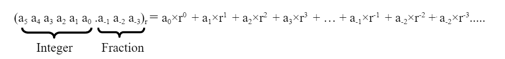
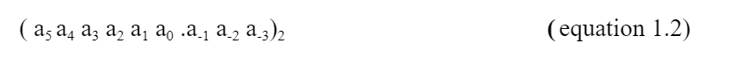

# Chapter 5: Number System Conversions

_Originally created 27 January, 2021 by Maxwell Hauser — Updated 6 October, 2025_

_Builds upon material from Chapter 4: Number Systems._

---

## Background

A number system is a way to represent numbers using a consistent set of symbols and rules. The most common number systems are:

1. Decimal (base 10)
2. Binary (base 2)
3. Hexadecimal (base 16)
4. Octal (base 8)

There are two main components of a number system:
1. The radix (or base): This is the number of unique digits, including zero, that a positional numeral system uses to represent numbers. For example, the decimal system has a base of 10, meaning it uses ten digits (0-9).
2. The coefficients (or digits): These are the symbols used to represent numbers in a given base. For example, in the decimal system, the digits are 0, 1, 2, 3, 4, 5, 6, 7, 8, and 9.

There are also several ways to convert a number from one base to another.

However, we must first understand the positional value of each digit in a number. The value of each digit is determined by its position (or place) in the number and the base of the number system.

Using the positional value of each digit in a given number, in a given base, we can calculate the value of the number.

The value can be calculated using the formula:
> 

where $a_{i}$ is the digit at position $i$ relative to the decimal point, and $r^{i}$ is the base raised to the power of $i$.

And also where (although not shown in the above figure), $a_{n}$ is the most significant digit (MSD), $n$ is the total number of digits in the number, $a_{m}$ is the least significant digit (LSD), and $m$ is the position of the LSD.

The some essential base conversions are covered in the following sections.

---

## Converting from Binary to Decimal

The following equation represents the general form of a binary number:

> 

where $a_{i}$ is a binary digit or bit (0 or 1).

To convert a binary number to decimal, evaluate the sum by substituting the values of $a_{i}$ and calculating the powers of 2.

**Example:** To convert $(110111.101)_2$ to decimal:

```
(110111.101)₂ = (1×2⁵) + (1×2⁴) + (0×2³) + (1×2²) + (1×2¹) + (1×2⁰) + (1×2⁻¹) + (0×2⁻²) + (1×2⁻³)
              = 32 + 16 + 0 + 4 + 2 + 1 + 0.5 + 0 + 0.125
              = 55.625₁₀
```

Visualization:

> 

32 + 16 + 0 + 4 + 2 + 1 + 0.5 + 0 + 0.125 = 55.625

---

A binary number that has all of its `n` bits set to `1` has a decimal value of `2^n - 1`.

**Pattern Observation:**

| Binary | Decimal | Formula |
|--------|---------|----------|
| $(1)_2$ | 1 | $2^1 - 1$ |
| $(11)_2$ | 3 | $2^2 - 1$ |
| $(111)_2$ | 7 | $2^3 - 1$ |
| $(1111)_2$ | 15 | $2^4 - 1$ |
| $(11111)_2$ | 31 | $2^5 - 1$ |

Binary, or base-2 numbers, are represented by 0s and 1s. A binary digit, 0 or 1, is called a **bit**.

**Common Terminology:**
- 1 bit = one binary digit (0 or 1)
- 8 bits = 1 byte
- 2 bytes = 1 half word (16 bits)
- 4 bytes = 1 word (32 bits)

---

## Converting from Decimal Integer to Binary

To convert an integer number from decimal to binary:

1. Divide the decimal number by the new base (2 for binary). This will result in a quotient and a remainder (either 0 or 1).
2. The first remainder will be the **least significant bit** of the binary number.
3. Continually divide the quotient by the new base, while taking each remainder as each subsequent bit in the binary number, until the quotient becomes zero.

For example, to convert 34 in decimal to binary:
```
     Quotient   | Remainder
34/2 = 17       | 0 = a0
17/2 = 8        | 1 = a1
8/2  = 4        | 0 = a2
4/2  = 2        | 0 = a3
2/2  = 1        | 0 = a4
1/2  = 0        | 1 = a5
```
Reading the remainders from bottom to top gives the binary representation:
```
34 = (100010)2
```

As stated above, a binary number is represented by:
$a_n a_{n-1} ... a_2 a_1 a_0 . a_{-1} a_{-2} ... a_{-m+1} a_{-m}$

where $a_n$ is the most significant bit (MSB) and $a_0$ is the least significant bit (LSB).

Consider the following table of $2^n$ with different values of $n$:
```
2^n  | Decimal Value
---  | -------------
2^0  | 1
2^1  | 2
2^2  | 4
2^3  | 8
2^4  | 16
2^5  | 32
2^6  | 64
2^7  | 128
2^8  | 256
2^9  | 512
2^10 | 1024    = 1K
2^11 | 2048    = 2K
2^12 | 4096    = 4K
2^13 | 8192    = 8K
2^14 | 16384   = 16K
2^15 | 32768   = 32K
2^16 | 65536   = 64K
2^17 | 131072  = 128K
2^18 | 262144  = 256K
2^19 | 524288  = 512K
2^20 | 1048576 = 1M
2^21 | 2097152 = 2M
2^22 | 4194304 = 4M
2^23 | 8388608 = 8M
```

---

## Converting a Decimal Fraction to Binary

A decimal number representation of $(0.XY)_{10}$ can be converted into base 2 and represented by:

$(0.a_{(-1)}a_{(-2)}...a_{(-m)})_2$

_Note: There is no multiplication being performed above. The individual $a$ terms are simply being concatenated to form the binary fraction._ 

To convert a decimal fraction to binary, follow these steps:

1. Multiply the fraction by 2. The product will have an integer component and a fraction component. The integer component may be either 0 or 1.

2. Let the integer component represent $a_{-1}$.

3. Multiply the fraction by 2.

4. Separate the integer component from the fraction.

5. Let the integer component represent $a_{-2}$.

6. Repeat this process until the fraction becomes zero.

7. As stated above, the binary representation of the decimal fraction is $(0.a_{-1} a_{-2} a_{-3} ... a_{-m})$.

For example, to convert (0.625)10 to binary:

1. $0.625 * 2 = 1.25 = 1 + 0.25$ &rarr; $a_{-1}=1$
2. $0.25 * 2 = 0.5 = 0 + 0.5$ &rarr; $a_{-2}=0$
3. $0.5 * 2 = 1.0 = 1 + 0.0$ &rarr; $a_{-3}=1$
4. $0.0 * 2 = 0.0 = 0 + 0.0$ &rarr; $a_{-4}=0$

Reading the integer components from top to bottom gives the binary representation:

$(0.625)10 = (0.101)2$

--- 

Sometimes, the calculated fraction does not reach zero. In other words, the converted target fraction is **repeating**, or more specifically, **nonterminating**. In this case, the order of precision (number of bits) assigned to the fraction is up to the discretion of the scientist.

---

## Hexadecimal Number System

The hexadecimal number system has a base of 16, and therefore uses 16 symbols (0 through 9, and A through F).

The following table shows the decimal numbers, their binary values from 0 to 15, and their hexadecimal equivalents.

```
Decimal | Binary | Hex
0       | 0000   | 0
1       | 0001   | 1
2       | 0010   | 2
3       | 0011   | 3
4       | 0100   | 4
5       | 0101   | 5
6       | 0110   | 6
7       | 0111   | 7
8       | 1000   | 8
9       | 1001   | 9
10      | 1010   | A
11      | 1011   | B
12      | 1100   | C
13      | 1101   | D
14      | 1110   | E
15      | 1111   | F
```

---

## Converting from Hex to Binary

The above table can be used to convert a hexadecimal number to binary by replacing each hex digit with its 4-bit binary equivalent.

## Converting from Binary to Hex

To convert a binary number to hexadecimal, group the binary digits into sets of four (starting from the right) and replace each group with its hexadecimal equivalent using the above table.

---

## Examples

Convert (001010011010)2 to hexadecimal. 

Referencing the previous table, each 4-bit group can be converted to its hexadecimal equivalent:
```
0010  1001  1010    
2     9     A

(001010011010)2 = (29A)16
```
---
Convert (3D5)16 to binary:
```
0011  1101  0101
3     D     5

(3D5)16 = (001111010101)2
```
---
Convert 6DB from hexadecimal to binary:
```
0110  1101  1011
6     D     B

(6DB)16 = (011011011011)2
```
---
Convert (110111.101)2 to decimal:
```
(110111.101)2 = (1*2^5)
              + (1*2^4)
              + (0*2^3)
              + (1*2^2)
              + (1*2^1)
              + (1*2^0)
              + (1*2^-1)
              + (0*2^-2)
              + (1*2^-3)

              = 32 + 16
              + 0 + 4
              + 2 + 1
              + 0.5 + 0
              + 0.125
            
              = 55.625 (decimal)
```
---
Basic Binary Addition:
```
1 + 0 = 1

1 + 1 = 10

1 + 1 + 1 = 11
```
---
Binary Addition with Bit Carrying:
```    
      111 1
   	   10101
    +  01101
------------
      100010
```
---
Binary Subtraction with Bit Borrowing:
```
       1
       10101
    -  01101
------------
       01000
```
---
